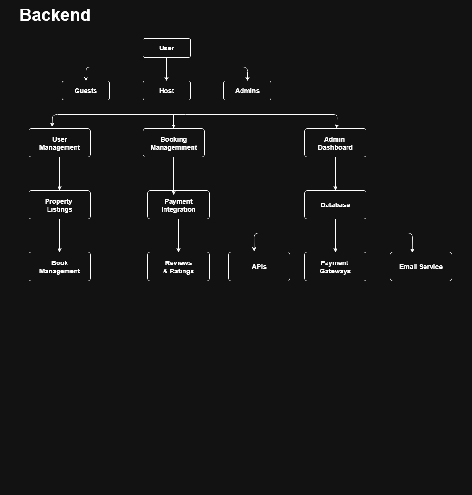

# Airbnb Clone – Backend Features and Functionalities

## Core Functionalities
- User Management (Registration, Login, Profile Management)
- Property Listings Management
- Search and Filtering
- Booking Management
- Payment Integration
- Reviews and Ratings
- Notifications System
- Admin Dashboard

## Technical Requirements
- Relational Database (PostgreSQL/MySQL)
- RESTful APIs
- Authentication & Authorization (JWT, RBAC)
- File Storage (AWS S3/Cloudinary)
- Email Services (SendGrid/Mailgun)
- Error Handling & Logging

## Non-Functional Requirements
- Scalability
- Security
- Performance Optimization
- Testing

## Diagram

